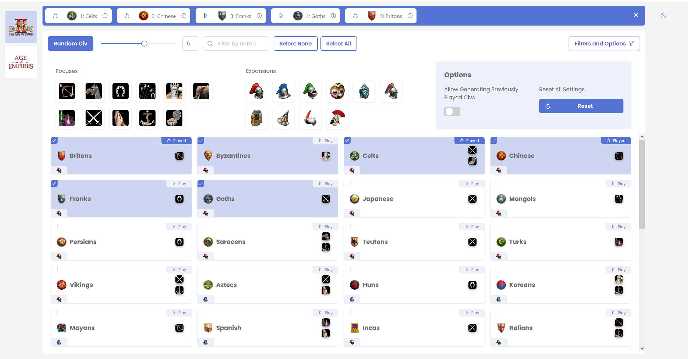

# Gagnismathr

Track which civilizations you have played in Age of Empires I and II. Randomly select a new civilization to play based on the filters you set. Live on [aoe.strootman.dev](https://aoe.strootman.dev).

## Installation

1. Clone the repository: `git clone https://github.com/davidstrootman/Gagnismathr.git`
2. Install dependencies: `npm install`

## Usage

1. Start the development server: `npm run dev`
2. Open the app in your browser: `http://localhost:5173`

## License

This project is licensed under the [MIT License](https://opensource.org/licenses/MIT).